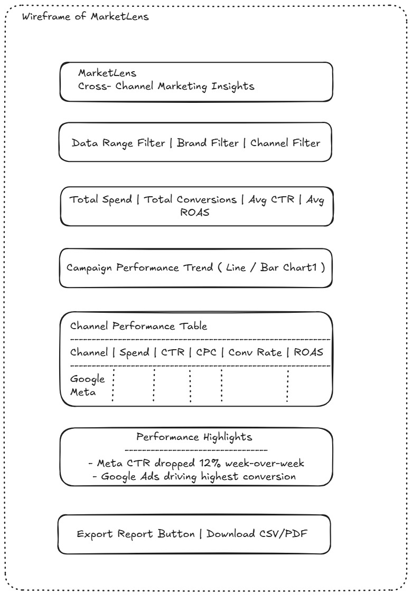

## MarketLens 

## Product Description
MarketLens is an internal marketing insights platform that helps teams quickly understand marketing performance across channels by bringing campaign data and insights into one simple view.

## Problem Statement 
Marketing performance data is currently spread across multiple platforms, requiring analysts to manually collect metrics, compare reports, and prepare updates for internal teams and clients.

This process is time-consuming, inconsistent, and dependent on individual team members. Different analysts may interpret data differently, making it difficult to maintain a consistent understanding of campaign performance across brands and channels

Teams need a faster and more reliable way to understand marketing performance without changing the tools they already use.

## Why's - The birth of MarketLens 

Why 1? 
- Because analysts manually collect data from multiple marketing platform

Why 2?
- Because campaign performance data is spread accross disconnected tools with different reporting formats.

Why 3?
- Because there is no centralized system that standardizes and consolidates marketing data into a unified view. 

Why 4?
- Because teams only rely on platform-native dashboards and manual interpretation rather than a shared reporting layer

Why 5?
- Because reporting workflows evolved operationally over time without a dedicated internal tool focused on cross-channel visibility and consistency

### Root cause identified 
The core issue is not the lack of marketing data, but the lack of a centralized and standardized reporting system that transforms fragmented platform data into consistent, actionable insights.

MarketLens is designed to solve this operational gap without requiring teams to replace their existing tools or workflows.

## Primary Users

The primary users of MarketLens are internal marketing analysts and account managers who regularly prepare campaign performance updates for clients. 

Secondary users may include leadership teams and clients who need a simplified view of marketing performance.

The first version of the platform is primarily focused on internal teams, as improving internal reporting efficiency creates the highest immediate value.

## Goals of the Tool

MarketLens is designed to 
- Reduce manual reporting effort
- Provide a unified view of marketing performance
- Standardize how campaign insights are presented
- Help teams quickly identify where attention is needed
- Reduce dependency on specific individuals for reporting 

## Proposed Solution 

MarketLens acts as a centralized intelligence layer on top of existing marketing platforms. 

The platform collects campaign data from multiple sources such as Google Ads, Meta Ads, LinkedIn Ads, and analytics tools, then transforms the data into a simplified and standardized reporting view. 

Instead of manually stitching together reports from different platforms, teams can use MarketLens to quickly understand campaign performance and identify key trends or issues.

## V1 Scope - The embryo version of MarketLens

The first version of MarketLens focuses on solving the core reporting and visibility problem.

Included in V1
- Cross- channel campaign performance dashboard
- Unified KPI view across platforms
- Basic trend visualization
- Standardized reporting metrics
- Automated insight summaries
- CSV/PDF export functionality
- Daily scheduled data refresh

Example Metrics
- Spend
- Impressions
- CTR
- CPC
- Conversion Rate
- ROAS

## Wireframe - The idea of visualization

The wireframe below represents the proposed V1 dashboard experience for MarketLens.

The Design focuses on:
- Unified cross-channel visibility
- Simplified Reporting
- Fast insight discovery
- Operational efficiency for internal teams



## Out of Scope (v1)

the following features are intentionally excluded from the first version:
- Real-time streaming analytics
- AI-Generated forecasting
- Campaign editing or management
- Custom dashboard builders
- Multi-tenant client portals
- Advanced attribution modelling
- Conversational AI assistants

These features add significant complexity without directly solving the primary reporting consistency problem

## Data Sources 

MarketLens integrates with existing marketing platforms without changing the current workflow.

Potential data sources include:
- Google Ads API
- Meta Ads API
- Linkedin Ads API
- Google Analytics
- CSV uploads for unsupported platforms

## High-Level Architecture - Skeleton of MarketLens 

```
Marketing Platforms
        ↓
Data Ingestion Layer
        ↓
Transformation & Standardization
        ↓
Centralized Data Store
        ↓
Insights & Dashboard Layer
        ↓
Internal Teams / Clients
```

## User Flow

- Marketing data is pulled from connected platforms on a scheduled basis.
- Data is standardized into a common reporting structure.
- MarketLens generates unified performance summaries and insights.
- Internal teams review campaign performance in a single dashboard.
- Temas use these insights to prepare faster and more consistent client updates.


## Trust & Reliability - The Soul of MarketLens 

To ensure users trust the platform, MarketLens includes:
- Source-level data tracebility
- Timestamped data refreshes
- Standardized metric definitions
- Error handling for failed integrations
- Consistent reporting logic across channels

## Future Improvements 
With additional time, future versions of MarketLens could include:
- AI-Powered insight explainations
- Forecasting and anamoly detection
- Role-Based access control
- Client-facing dashboards
- Slack or email alert integrations


 
